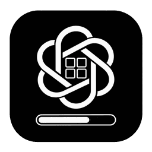

[](https://opensource.org/licenses/MIT)

[English](README.md) | **简体中文**

# Codex Usage




一款轻量级 Windows 原生任务栏小组件，专门用于监控 **Codex 用量**。当前 v1.0.2 Fork 已正式收敛为 Codex-only：读取 Codex 自身维护的本地登录凭据，并在任务栏直接显示 5 小时和每周额度的剩余量。

## 功能

- 显示 Codex **5h** 和 **7d** 剩余额度
- 显示重置时间/日期及倒计时信息
- 紧凑、极简两种任务栏外观
- 可分别显示 5h / 7d，用量行至少保留一行
- 可在剩余额度 10%、20% 或 30% 时提醒，每个重置窗口只提醒一次
- 刷新间隔支持 1 分钟、5 分钟、15 分钟和 1 小时
- 跟随 Windows 明/暗主题
- 支持简体中文及多种界面语言
- 支持多显示器任务栏，并支持按住鼠标时实时跨任务栏拖动、DPI-aware 鼠标锚点和 A → B → A 连续拖动
- 保留 Explorer 重启恢复与单实例保护
- 未显式配置代理环境变量时，可读取 Windows 当前用户的手动系统代理
- 保留一个托盘图标用于刷新、设置和退出；任务栏组件在程序运行期间始终显示

## 安全行为

本 Fork 明确删除了监控程序自动调用 Codex CLI 刷新 Token 的能力。

程序从 `$CODEX_HOME/auth.json` 或 `~/.codex/auth.json` 读取 Codex 凭据，并通过 HTTPS 请求 Codex 用量接口。如果接口返回 `401` 或 `403`，监控器会显示认证错误并暂停轮询，直到本地凭据来源发生变化。它**不会启动 `codex.exe`、`codex.cmd`、`codex.ps1`，也不会执行 `codex exec`** 来刷新凭据。

登录失效时，请由你自己通过官方 Codex CLI / Codex 应用重新登录，然后刷新或重启 Codex Usage。

## 系统要求

- Windows 10 或 Windows 11
- 已安装并完成身份验证的 Codex CLI 或 Codex 应用

## 安装

如需按用户安装，请从 [Fork 最新 Release](https://github.com/walle-2017/codex-usage-monitor/releases/latest) 下载 `install.ps1`，然后运行：

```powershell
powershell.exe -NoProfile -ExecutionPolicy Bypass -File .\install.ps1
```

安装程序会校验 Release 文件的 SHA256，无需管理员权限，安装到 `%LOCALAPPDATA%\Programs\CodexUsage`，并创建开始菜单、桌面快捷方式和 Windows“已安装的应用”卸载项。

如需便携使用，可从同一 Release 下载 `codex-usage.exe` 并直接运行。也可以本地构建：

```powershell
cargo build --release
```

可执行文件位于 `target\release\codex-usage.exe`。

## 卸载

可在 Windows“设置”>“应用”>“已安装的应用”中卸载 **Codex Usage**，或运行：

```powershell
powershell.exe -NoProfile -ExecutionPolicy Bypass -File "$env:LOCALAPPDATA\Programs\CodexUsage\uninstall.ps1"
```

普通卸载会保留 `%APPDATA%\CodexUsage\settings.json`。如需彻底删除设置，请增加 `-RemoveSettings`。详情见[安装机制](docs/installation.md)。

## 使用

运行 `codex-usage.exe` 或安装后的快捷方式。程序会把组件嵌入所选 Windows 任务栏，同时在通知区域保留一个托盘图标。

- 拖动左侧手柄可调整组件位置。
- 多显示器环境下，保持按住鼠标并将组件拖入另一块屏幕的任务栏，组件会立即重新挂载；鼠标会继续保持在拖动手柄相同的逻辑抓取位置，并根据目标任务栏 DPI 自动换算，在不同缩放比例的显示器之间继续跟随。
- 右键任务栏组件或托盘图标，可使用刷新、刷新频率、用量行、额度提醒、外观、开机启动、重置位置、语言、只读版本号和退出等设置。
- 任务栏组件在进程运行期间固定保持显示，不再提供隐藏/显示开关。

### 用量与提醒

所有语言下统一使用**剩余额度**语义：百分比文字、进度长度和状态色都基于同一个剩余百分比。

可以同时显示两个额度周期，也可仅显示其中一个。额度提醒可设为剩余 10%、20% 或 30%，并按重置窗口去重。

### 外观

当前保留两种任务栏预设：

- **紧凑**：进度条 + 百分比 + 重置时间/日期
- **极简**：进度条 + 百分比

两种预设均跟随 Windows 明/暗主题。Windows 小任务栏使用单独适配的布局以保证可读性。

## 网络与系统代理

如果已经显式设置 `HTTPS_PROXY`、`HTTP_PROXY` 或 `ALL_PROXY`，HTTP 客户端按正常环境变量规则使用代理。否则，Windows 下会尝试读取当前用户的手动代理：

```text
HKCU\Software\Microsoft\Windows\CurrentVersion\Internet Settings
```

读取 `ProxyEnable` / `ProxyServer`，并只应用到当前进程，不会修改 Windows 代理配置。当前不实现 PAC/WPAD 自动代理发现。

Codex 用量请求会在 TLS 连接中携带 OAuth Bearer Token，因此应只使用可信代理。

## 诊断

运行：

```powershell
codex-usage.exe --diagnose
```

日志写入 `%TEMP%\codex-usage.log`，会记录应用/版本、可执行文件路径、轮询失败类别、重试时间和任务栏恢复事件，但不会记录访问令牌或凭据文件内容。详情见[故障排除](docs/troubleshooting.md)。

设置保存在：

```text
%APPDATA%\CodexUsage\settings.json
```

当前设置包括任务栏位置/屏幕、轮询频率、语言、外观、可见额度行、提醒阈值及提醒去重状态。

## 隐私与安全

程序读取本地 Codex access token / account id，并仅在查询 ChatGPT Codex 用量接口时用于认证。项目没有独立后端，不收集 Analytics 或 Telemetry，也不会上传项目文件。

监控器不会直接修改 `auth.json`，也不会为了恢复认证而启动 Codex CLI 子进程。

## 版本与升级

当前正式版本为 **1.0.2**。程序菜单显示的 `v1.0.2` 和 Windows EXE 版本元数据都来自同一个包版本源；清理后的首个 Codex-only 安全基线版本为 `v1.0.0`。

程序内部不包含更新检查或程序内升级器。升级需要由用户显式安装新的 Fork Release，或自行替换便携版可执行文件。

## 开源说明

项目采用 MIT License，保留原始 [LICENSE](LICENSE) 和版权声明。

Codex Usage 源自 [CodeZeno/Claude-Code-Usage-Monitor](https://github.com/CodeZeno/Claude-Code-Usage-Monitor) 以及后续上游工作。当前 Fork 独立维护，与上游维护者或 OpenAI 不存在隶属或背书关系。

Fork 的安全约束和后续同步基线见 [README-FORK.md](README-FORK.md)。

### 应用内更新

**设置**中的版本号可点击。点击后只检查 `walle-2017/codex-usage-monitor` 当前 Fork 的最新稳定 Release。发现新版本时，程序会下载 `codex-usage.exe` 与 `codex-usage.exe.sha256`，完成 SHA256 校验后安全替换当前安装版或便携版程序并自动重启。当前版本不会在启动时或后台定时检查更新。

